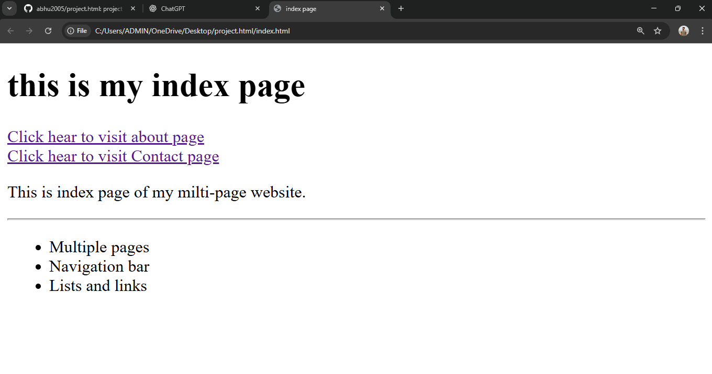
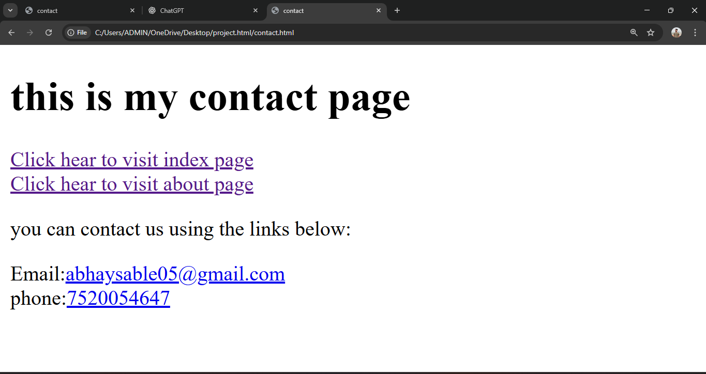

# 🌐 Simple HTML Website Project

A beginner-friendly **HTML website project** created to understand the fundamentals of web development.  
This project includes multiple pages such as Home, About, and Contact, built using only **HTML**.

---

## 📌 Features

- 🏠 Home Page  
- ℹ️ About Page  
- 📞 Contact Page  
- 📄 Clean and simple layout  
- 🎯 Beginner-friendly structure  

---

## 🛠️ Technologies Used

- **HTML5**

---

## 📷 Project Screenshots

### 🏠 Home Page

### ℹ️ About Page

### 📞 Contact Page

---

## 🚀 Live Demo

👉 [Click here to view the live project](https://project-infoo.netlify.app)

---

## 📂 Project Structure

---

## 💡 How to Use

1. Download or clone the repository  
2. Open `index.html` in any web browser  
3. Navigate through the pages  

---

## 🙌 Author

**Abhu**  
GitHub: [@abhu2005](https://github.com/abhu2005)
---
⭐ If you like this project, don’t forget to **star the repository**!
